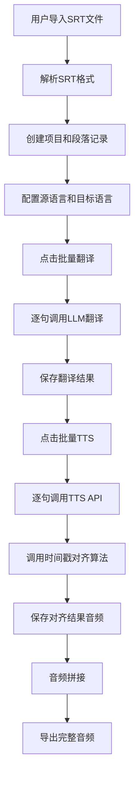
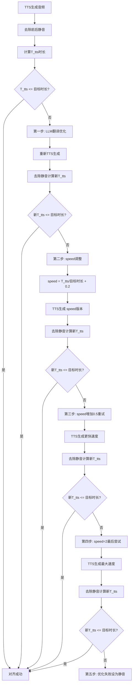

# MiniMax Translation Studio 产品需求文档 (PRD)

## 📋 产品路线图

### 核心目标 (Mission)
打造企业级智能视频翻译平台，通过AI驱动的时间戳对齐和音色克隆技术，让多语言视频内容制作变得简单高效。

### 用户画像 (Persona)
- **主要用户**：企业内部翻译团队、视频制作公司的翻译专员
- **核心痛点**：手动时间戳对齐耗时巨大、多人对话翻译复杂、音色不一致影响观感
- **使用场景**：企业内部使用或对签约用户提供Web服务，支持10人同时使用，最多100注册用户

### V1: 最小可行产品 (MVP) - SRT智能翻译平台
- [x] 用户认证系统（group_id + API key验证）
- [x] SRT文件导入/导出功能
- [x] 基础项目管理（创建、删除、列表，每用户最多5个项目）
- [x] LLM批量翻译功能（基于MiniMax-Text-01）
- [x] 核心时间戳对齐算法（包含5步优化流程）
- [x] TTS语音合成（支持speed调节、情绪参数）
- [x] 人工修正界面（逐句编辑）
- [x] 音频拼接和导出
- [x] 实时日志系统（完整trace_id追踪）
- [x] 基础参数配置（语言对、TTS模型、角色音色映射表、专有词汇表）

### V2: 视频翻译增强版
- [ ] 视频文件上传和处理
- [ ] 本地模型集成（Whisper ASR + Demucs人声分离 + PyAnnote说话人识别）
- [ ] 音色克隆功能（基于MiniMax克隆API）
- [ ] 视频+音频合成
- [ ] 多轨道音视频预览

### V3: 企业级功能
- [ ] 批量项目管理
- [ ] 团队协作功能
- [ ] 高级音频编辑
- [ ] 自定义模型训练
- [ ] API接口开放

## 📊 关键业务逻辑 (Business Rules)

### 时间戳对齐优先级
1. **第一优先级**：T_tts ≤ 原时间戳
2. **第二优先级**：翻译质量保持
3. **第三优先级**：语速调节适中

### 容错机制
- 每个API调用支持2次重试
- 失败后降级处理（设为静音）
- 完整错误日志记录

### 并发控制（per user）
- LLM请求：1次/秒
- TTS/克隆请求：1次/3秒
- 后台可动态调整策略

### 存储限制
- 每用户最多5个项目
- 自动清理30天前的临时文件

## 💾 数据契约 (Data Contract)

### 核心数据表结构
```sql
-- 用户表
Users: id, group_id, api_key, created_at, last_login

-- 项目表
Projects: id, user_id, name, source_lang, target_lang,
          srt_file_path, video_file_path, tts_model, voice_mappings,
          custom_vocabulary, status, created_at, updated_at

-- 段落表
Segments: id, project_id, index, start_time, end_time, speaker,
          original_text, translated_text, voice_id, emotion, speed,
          original_audio_url, translated_audio_url, t_tts_duration,
          target_duration, ratio, status, created_at, updated_at

-- 用户配置表
Configs: id, user_id, api_endpoint, group_id, api_key, created_at
```

## 🎨 MVP原型设计

### 选定方案：Web端专业编辑器
**设计理念**：左侧段落详情表格 + 右侧完整音视频轨道，音轨自动跟随左侧操作定位

#### 页面架构
1. **项目管理页**：项目CRUD、快速开始向导
2. **编辑器页**：主工作区，段落编辑 + 音视频预览
3. **配置中心页**：API配置、语言设置、角色音色映射表、专有词汇表
4. **数据统计页**：处理进度、质量指标、API使用情况
5. **操作日志页**：完整trace_id日志、筛选、导出

#### 核心编辑器界面特点
- **段落参数完整可编辑**：序号、时间戳、说话人、原文、翻译文本、voice_id、情绪参数、速度参数、音频文件、时长数据、状态、操作按钮
- **音视频轨道同步**：点击左侧段落，右侧轨道自动定位到对应时间位置
- **实时预览**：完整5分钟音视频轨道，当前段落高亮显示
- **批量操作**：支持多选段落进行批量翻译、TTS、角色修改等

## 🏗️ 架构设计蓝图

### 技术选型
- **前端**：Vue 3 + Element Plus + TypeScript
- **后端**：Django + Django REST Framework
- **数据库**：PostgreSQL（项目数据、段落信息）
- **文件存储**：本地存储 + 自动清理机制
- **AI服务**：MiniMax API套件（LLM + TTS + 音色克隆）

### 核心业务流程图

#### SRT翻译主流程


#### 时间戳对齐算法


### 组件交互说明

#### 新增核心模块
```
backend/
├── apps/
│   ├── authentication/     # 用户认证（group_id + API key）
│   ├── projects/          # 项目管理
│   ├── segments/          # 段落数据处理
│   ├── translation/       # LLM翻译服务
│   ├── tts/              # TTS合成服务
│   ├── audio/            # 音频处理和拼接
│   └── logs/             # 日志记录
├── services/
│   ├── minimax_client.py  # MiniMax API客户端
│   ├── srt_parser.py     # SRT文件解析
│   ├── audio_processor.py # 音频处理
│   └── timestamp_aligner.py # 时间戳对齐算法
└── utils/
    ├── batch_processor.py  # 批量处理工具
    └── progress_tracker.py # 进度追踪

frontend/
├── views/
│   ├── ProjectManagement.vue    # 项目管理页
│   ├── Editor.vue              # 核心编辑器页
│   ├── Configuration.vue       # 配置中心页
│   ├── Statistics.vue          # 数据统计页
│   └── Logs.vue               # 操作日志页
├── components/
│   ├── SegmentTable.vue        # 段落表格组件
│   ├── AudioVideoTrack.vue     # 音视频轨道组件
│   ├── TTSParameterPanel.vue   # TTS参数面板
│   └── BatchOperations.vue     # 批量操作组件
└── services/
    ├── api.js                  # API调用封装
    ├── audio.js               # 音频播放控制
    └── websocket.js           # 实时日志推送
```

#### API接口设计
```
POST /api/projects/                    # 创建项目
GET  /api/projects/{id}/segments/      # 获取段落列表
POST /api/segments/{id}/translate/     # 翻译单个段落
POST /api/segments/{id}/tts/           # TTS单个段落
POST /api/segments/batch-translate/    # 批量翻译
POST /api/segments/batch-tts/          # 批量TTS
POST /api/audio/concatenate/{project_id}/ # 音频拼接
GET  /api/logs/{project_id}/           # 获取项目日志
```

### 技术选型与风险

#### 关键技术选型
1. **MiniMax AI生态**：统一的LLM + TTS + 音色克隆服务
2. **PostgreSQL**：支持JSON字段存储复杂参数，全文搜索能力强
3. **Django同步处理**：MVP阶段使用同步API调用，简化架构
4. **Vue 3 + Element Plus**：成熟的企业级UI组件库

#### 潜在技术风险
1. **API限流风险**：MiniMax API的并发限制
   - 缓解方案：实现请求队列和重试机制
2. **大文件处理**：5分钟视频可能达到几百MB
   - 缓解方案：分块上传、断点续传
3. **音频同步精度**：不同浏览器的音频播放差异
   - 缓解方案：使用Web Audio API精确控制
4. **并发用户冲突**：多用户同时编辑同一项目
   - 缓解方案：乐观锁机制，实时同步状态

## 🎯 部署规范

### 系统要求
- **服务器**：4核CPU、16GB RAM、500GB SSD
- **网络**：HTTPS访问，默认端口5215
- **操作系统**：Linux (推荐Ubuntu 20.04+)
- **容器化**：Docker + Docker Compose

### 环境配置
```yaml
# docker-compose.yml
services:
  backend:
    build: ./backend
    ports:
      - "8000:8000"
    environment:
      - DATABASE_URL=postgresql://user:pass@db:5432/minimax_translation
      - MINIMAX_API_KEY=${MINIMAX_API_KEY}
      - MINIMAX_GROUP_ID=${MINIMAX_GROUP_ID}

  frontend:
    build: ./frontend
    ports:
      - "5215:5215"
    depends_on:
      - backend

  db:
    image: postgres:15
    environment:
      - POSTGRES_DB=minimax_translation
      - POSTGRES_USER=user
      - POSTGRES_PASSWORD=pass
    volumes:
      - postgres_data:/var/lib/postgresql/data

```

## 📈 成功指标

### MVP验收标准
1. **功能完整性**：SRT导入→翻译→TTS→音频拼接→导出全流程无阻
2. **时间戳对齐率**：≥85%的段落能成功对齐时间戳
3. **系统稳定性**：支持10个用户同时使用，无崩溃
4. **API成功率**：≥95%的API调用成功，完整trace_id记录
5. **用户体验**：从导入SRT到导出音频，整个流程≤30分钟（100段落以内）

### 未来迭代目标
- V2版本增加视频翻译功能，支持音色克隆
- V3版本开放API，支持第三方集成
- 最终目标：成为企业级视频翻译的标准工具

---

## 📝 开发备注

### API示例文件位置
- `/home/Devin/minimax_translation/api_example/trans.py` - LLM翻译示例
- `/home/Devin/minimax_translation/api_example/t2a_v2_mini_url.py` - TTS合成示例
- `/home/Devin/minimax_translation/api_example/clone.py` - 音色克隆示例
- `/home/Devin/minimax_translation/api_example/trans_optimization.py` - 翻译优化示例

### 开源计划
项目调试完成后将打包上传GitHub开源，采用MIT许可证。

---

**文档版本**：v1.0
**最后更新**：2024-12-23
**负责人**：产品设计团队 & 技术架构团队